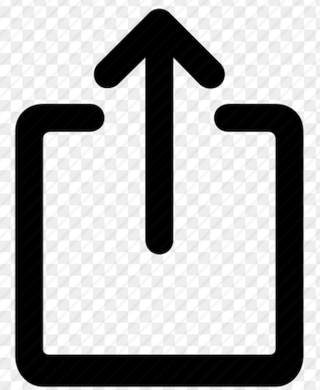

# Complete Guide: Push Notifications on iPhone and iPad

Push notifications for OnDeck Manager work on iOS devices (iPhone and iPad), but Apple's implementation requires a few extra steps compared to Android or desktop browsers. This guide will walk you through the complete setup process to ensure you never miss a race.

**Important:** iOS web push notifications require iOS 16.4 or later. If you're using an older version of iOS, you'll need to update your device first.

<!-- truncate -->

## Why iOS is Different

Apple implemented web push notifications starting with iOS 16.4 (released March 2023), with specific requirements that differ from other platforms:

- **Home Screen required:** The website must be added to your Home Screen as a web app
- **Browser support:** Safari, Chrome, Edge, and Firefox all support web push on iOS

While this requires a few extra steps compared to other platforms, once configured, the experience is seamless and notifications work just like any other app on your device.

**Note for EU users:** If you're in the European Union, web push notifications may not be available on iOS due to regulatory compliance changes in iOS 17.4.

## Supported Browsers

The following browsers support web push notifications on iOS:

- **Safari** (default iOS browser)
- **Google Chrome** (version 113 or later)
- **Microsoft Edge**
- **Firefox**

You can use any of these browsers to set up push notifications. The setup process is similar across all browsers, though this guide uses Safari for examples.

## Step-by-Step Setup Guide

### Step 1: Check Your iOS Version

First, verify you're running iOS 16.4 or later:

1. Open the **Settings** app on your device
2. Tap **General**
3. Tap **About**
4. Look at **Software Version**—it should show 16.4 or higher

### Step 2: Open OnDeck Manager in Your Browser

1. Open your Safari browser app
2. Navigate to [ondeckmanager.com](https://ondeckmanager.com)
3. Stay on the home page (don't navigate to a specific tournament yet)

**Why start at the home page?** By creating the app from the root of ondeckmanager.com, you'll be able to access any tournament in the future without additional setup.

### Step 3: Add OnDeck Manager to Your Home Screen

This creates a web app icon on your home screen, which is required for iOS push notifications.

**In Safari:**

1. While on the ondeckmanager.com home page, tap the **Share** button at the bottom center of the screen 
   - The Share button looks like a square with an arrow pointing up
2. In the share menu, **scroll down** to find and tap **Add to Home Screen**
   - You may need to scroll down in the menu to see this option
3. Tap **Add** in the top right corner

An "OnDeck" icon will now appear on your Home Screen, just like a regular app.

### Step 4: Open OnDeck Manager from Your Home Screen

This step is essential—you must launch the site from the Home Screen icon:

1. Go to your iPhone or iPad Home Screen
2. Find and tap the **OnDeck** icon you just added
3. The site will open in a full-screen web app view (without the browser address bar)

**Important:** Opening the site directly from your browser won't enable push notifications—you must use the Home Screen icon.

### Step 5: Navigate to Your Tournament and Create Your Digital Dance Card

Now you'll set up which teams you want to track:

1. In the OnDeck Manager web app, find and select the tournament you're attending
2. Navigate to the tournament schedule
3. Find the **Digital Dance Card** feature
4. Tap to add clubs or teams you want to follow
5. Add at least one club or team to trigger the notification permission prompt

### Step 6: Allow Notifications

After adding your first club or team to your Dance Card, you'll see a notification permission dialog:

1. A popup will appear asking: **"OnDeck" Would Like to Send You Notifications**
2. Tap **Allow**

If you accidentally tap "Don't Allow," don't worry—see the troubleshooting section below to fix it.

### Step 7: Verify Your Settings

Confirm notifications are properly enabled:

1. Go to your device **Settings** app
2. Scroll down and tap **OnDeck** (or whatever name you chose for the Home Screen icon)
3. Tap **Notifications**
4. Ensure **Allow Notifications** is turned on (green)
5. Configure your preferences:
   - **Lock Screen:** On (to see notifications when device is locked)
   - **Notification Center:** On
   - **Banners:** Set to "Temporary" or "Persistent"
   - **Sounds:** On (if you want audio alerts)
   - **Badges:** On (to show notification count on the app icon)

### Step 8: Test Your Setup

It's important to verify everything is working:

1. Make sure you have at least one team added to your Dance Card
2. Keep the OnDeck Manager web app open or minimize it
3. When a team you're tracking is called to the hole, you should receive a notification
4. The notification will appear even if your screen is locked or you're using other apps

## Understanding iOS Notification Behavior

**When notifications appear:**

- When your screen is locked
- When you're using other apps
- When OnDeck Manager is minimized
- When your device is in your pocket or on a table

**When notifications may NOT appear:**

- If OnDeck Manager app is actively open and in the foreground (you're already looking at it)
- If Do Not Disturb or a Focus mode is enabled (unless configured to allow OnDeck Manager)
- If you've disabled notifications in Settings
- If your device has no internet connection

## Managing Your Notifications

### Adjusting Notification Style

You can customize how notifications appear:

1. Go to Settings → OnDeck Manager → Notifications
2. Choose your alert style:
   - **Banners (Temporary):** Appear briefly at the top, then disappear
   - **Banners (Persistent):** Stay on screen until dismissed
   - **None:** Notifications go only to Notification Center
3. Toggle sounds, badges, and preview options

### Using Focus Modes and Do Not Disturb

If you use Focus modes (Do Not Disturb, Sleep, Work, etc.):

1. Open **Settings** → **Focus**
2. Tap the Focus mode you use (e.g., Do Not Disturb)
3. Under **Allowed Notifications**, tap **Apps**
4. Find and add **OnDeck Manager** to the allowed list
5. Now you'll receive race notifications even during Focus mode

### Temporarily Disabling Notifications

If you need to pause notifications during a tournament:

**Option 1: Remove teams from your Dance Card**

- Open OnDeck Manager from your Home Screen
- Remove all teams from your Dance Card
- Notifications will stop until you add teams back

**Option 2: Turn off notifications temporarily**

- Settings → OnDeck Manager → Notifications
- Toggle off **Allow Notifications**
- Remember to turn it back on later

## Troubleshooting Common iOS Issues

### "I don't see the notification permission prompt"

This usually means you need to complete the Home Screen setup:

1. Delete the OnDeck Manager icon from your Home Screen (long press → Remove App → Remove from Home Screen)
2. Open your browser and go to ondeckmanager.com
3. Follow Steps 3-6 again, making sure to:
   - Add the site to Home Screen from your browser
   - Open it FROM the Home Screen icon (not from the browser)
   - Then add teams to your Dance Card

### "I accidentally tapped 'Don't Allow'"

You can reset the notification permission:

**Method 1: Through Browser Settings**

_For Safari:_

1. Go to Settings → Safari
2. Scroll down to **Advanced**
3. Tap **Website Data**
4. Find "ondeckmanager.com" and swipe left to delete it
5. Restart your device
6. Follow the setup steps again from Step 2

_For Chrome:_

1. Open Chrome and go to Settings
2. Tap **Privacy and Security** → **Site Settings** → **Notifications**
3. Find ondeckmanager.com and remove it
4. Restart your device
5. Follow the setup steps again from Step 2

**Method 2: Remove and Re-add**

1. Delete the OnDeck Manager icon from your Home Screen
2. Clear website data (see Method 1 for your browser)
3. Restart your device
4. Follow the complete setup process again

### "Notifications aren't appearing"

**Check these items:**

1. **iOS version:** Settings → General → About → Software Version (must be 16.4+)
2. **Browser version:** Ensure you're using an updated version of your browser
3. **Notification permissions:** Settings → OnDeck Manager → Notifications → Allow Notifications (should be on)
4. **Focus mode:** Settings → Focus → check if Do Not Disturb is blocking notifications
5. **Internet connection:** Ensure you have wifi or cellular data
6. **Teams added:** Verify you have clubs/teams on your Dance Card
7. **Launch method:** Always open OnDeck Manager from the Home Screen icon, not directly from your browser

### "The notifications are delayed"

Delays can happen due to:

- **Weak internet connection:** Move to an area with better wifi/cellular signal
- **Background App Refresh:** Go to Settings → General → Background App Refresh → ensure it's enabled
- **Low Power Mode:** Disable Low Power Mode temporarily (Settings → Battery)
- **Too many apps open:** Close unused apps to free up system resources
- **Browser restrictions:** Some browsers may have different background refresh policies

### "OnDeck Manager doesn't appear in my Settings"

This means the web app isn't properly installed:

1. Verify you added the site to your Home Screen from a supported browser
2. Make sure you opened it at least once from the Home Screen icon
3. Try removing and re-adding the Home Screen icon following Step 3
4. Ensure you're using iOS 16.4 or later

### "The icon disappeared from my Home Screen"

This can happen after iOS updates or storage management:

1. Check if it was moved to another screen or folder
2. Search for "OnDeck" using iPhone search (swipe down on home screen)
3. If missing, follow Steps 2-3 to add it back
4. Your notification settings should be preserved

### "Which browser should I use?"

All supported browsers work similarly on iOS:

- **Safari:** Pre-installed, no download needed, most tested
- **Chrome:** Good if you prefer Chrome ecosystem
- **Edge:** Good for Microsoft ecosystem users
- **Firefox:** Good for privacy-focused users

Choose the browser you're most comfortable with—the notification experience is similar across all of them.

## Multiple Devices

You can set up push notifications on multiple iOS devices:

1. Follow this complete setup guide on each device
2. Each device will receive notifications independently
3. Your Dance Card selections may need to be set up on each device
4. This is useful for having notifications on both your iPhone and iPad

## Privacy and Permissions

**What OnDeck Manager can access:**

- Permission to send notifications
- Your selected Dance Card preferences

**What OnDeck Manager cannot access:**

- Your contacts, photos, or other apps
- Your location (unless you separately grant location permission)
- Any data from other websites or apps

You can revoke notification permission at any time through Settings → OnDeck Manager → Notifications.

## Tips for Tournament Day

1. **Set up before you arrive:** Complete the setup process at home with a test tournament to ensure everything works
2. **Keep your device charged:** Receiving notifications does use battery—bring a portable charger
3. **Check your connection:** Verify you have good wifi or cellular service at the venue
4. **Adjust volume:** Set notification sounds to a level you'll hear in a noisy tournament environment
5. **Configure Focus:** Set up a custom Focus mode that allows OnDeck Manager while blocking other apps
6. **Test early:** Add a team to your Dance Card early in the day to confirm notifications are working
7. **Bookmark the Home Screen icon location:** Remember where you placed it so you can find it quickly

## Updating iOS or Your Browser

If you install an iOS update or browser update:

- Your notification settings should be preserved
- The Home Screen icon should remain
- If notifications stop working after an update, try:
  1. Reopening OnDeck Manager from the Home Screen
  2. Checking Settings → OnDeck Manager → Notifications
  3. If needed, remove and re-add the Home Screen icon

## Frequently Asked Questions

**Q: Which browser works best on iOS?**
A: All supported browsers (Safari, Chrome, Edge, Firefox) work well. Safari is pre-installed and most commonly used, but any of them will provide a good notification experience.

**Q: Do I need to keep my browser open?**
A: No. Once you've opened OnDeck Manager from the Home Screen icon, you can close it or use other apps. Notifications will still appear.

**Q: Will this use a lot of battery?**
A: No. Push notifications are designed to be battery-efficient. The impact is minimal.

**Q: Can I use this on my Apple Watch?**
A: Yes! Notifications should automatically appear on your Apple Watch if it's paired with your iPhone and notifications are enabled.

**Q: Does this work on iPad?**
A: Yes! Follow the exact same steps on your iPad running iPadOS 16.4 or later.

**Q: What if my tournament venue has poor wifi?**
A: Notifications require an internet connection. Use cellular data if wifi is unreliable, or ask tournament organizers about wifi access.

**Q: Can I share the app with my teammates?**
A: Yes! Share this guide with your team. Each person needs to set up their own device following these steps.

**Q: I'm in the EU and this isn't working. Why?**
A: Apple removed web push notification support in EU regions with iOS 17.4 to comply with the Digital Markets Act. Unfortunately, this feature is not available in the EU at this time.

**Q: Can I switch browsers after setup?**
A: Yes, but you'll need to set up the Home Screen icon and permissions again for each browser you want to use.

## Need More Help?

If you're still experiencing issues with iOS push notifications:

1. Verify you're following each step exactly as described
2. Ensure your iOS version is 16.4 or later
3. Confirm you're using a supported browser (Safari, Chrome, Edge, or Firefox)
4. Try the troubleshooting steps above
5. Check ondeckmanager.com for system status updates
6. Reach out to tournament organizers for device-specific wifi issues

For general push notification information and setup for other platforms, see our main article: [Stay in the Know with Push Notifications](/blog/push-notifications-setup).

## Conclusion

While iOS requires a few extra setup steps compared to other platforms, the end result is a seamless notification experience that keeps you informed throughout tournament day. The flexibility to use Safari, Chrome, Edge, or Firefox means you can stick with your preferred browser while still receiving timely race alerts.

Once configured, push notifications work reliably across all supported browsers, giving you the freedom to relax between races without constantly checking the schedule.

Take a few minutes to complete this setup before your next tournament, and experience the convenience of never missing another race call.

Happy racing!
