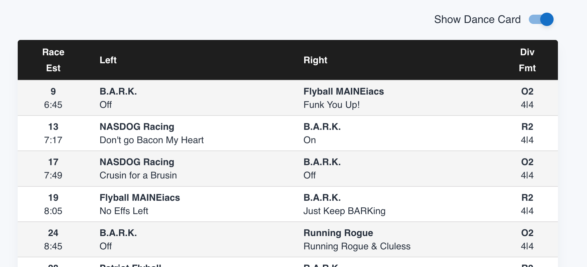
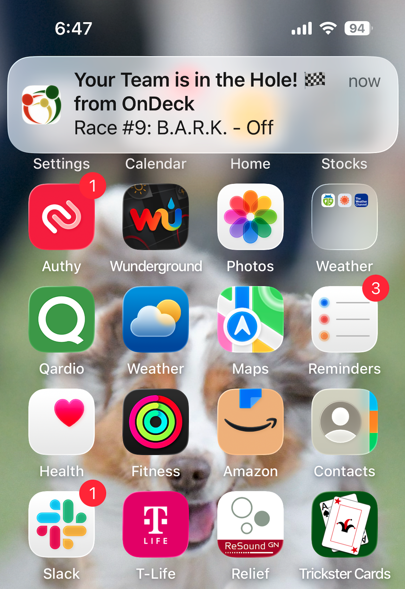
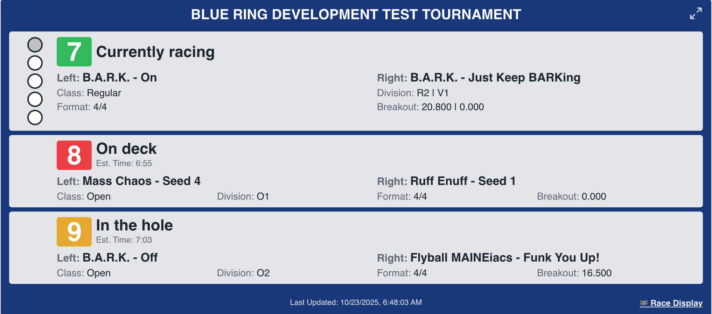

# Dance Cards, Push Notifications, Dog Heights, C.2 Forms, and More!

Version 7.1.0 of Flyball Manager has been released alongside updates to ondeckmanager.com, bringing a host of new capabilities to improve your tournament experience. I'm particularly excited to announce that you can now receive push notifications when races you're tracking are about to start—a feature many of you have been requesting.

This release includes numerous enhancements. Let me walk you through what's new.

<!-- truncate -->

## Digital Dance Cards

OnDeckManager.com now offers digital "Dance Cards"—a modern take on the traditional paper slips used to track specific races. I've brought this concept online with the new Dance Card feature.

The digital version allows you to select specific clubs and teams you want to follow, filtering the schedule to display only those races. In the example above, I've configured my Dance Card to track all races for my club (B.A.R.K.). Simply toggle the switch, and the schedule updates to show only your selected races.

## Push Notifications

This major feature deserves its own detailed explanation (see our separate blog post for complete setup instructions). When you add clubs or teams to your Dance Card for the first time, you'll be prompted to allow notifications from ondeckmanager.com.

Once enabled, you'll receive timely notifications on your phone, tablet, smart watch, or laptop whenever a team on your Dance Card is called to the hole. This ensures you never miss when it's time to head to the ring.

**Note for iOS users:** Apple devices require an additional setup step. Please refer to our dedicated blog post for detailed instructions on enabling push notifications on iOS devices.

## Dog Heights from NAFA Data Feed

A small but significant improvement: NAFA has introduced a data feed that includes dog heights. Flyball Manager now integrates with this source, automatically displaying dog heights during lineup management.

## Online C.2 Forms

Tournament results now include a convenient option to view team C.2 forms directly online. This makes it easy to verify data entry immediately after racing. C.2 forms update in near real-time as races are completed.

## Enhanced Team Results

The C.2 form is now accessible from the Team Results page as well. I've also added a quick link to view the opposing team's results—perfect for keeping tabs on the competition.

## Redesigned On Deck Panel

The On Deck panel has received a visual refresh. While originally designed with smaller tournaments in mind, I'm developing Flyball Manager with the flexibility to scale up to larger events. The updated panel improves readability and presents information in a more polished, professional format.

Tournament hosts can now expand the On Deck panel to full-screen mode by clicking the zoom icon in the upper right corner. This is ideal for displaying racing status on monitors throughout your venue, keeping everyone informed.

## Ringside Display Goes Online

Several years ago, I worked with judges to develop a ringside display that presents the information they need at a glance. Until now, this display has been physically connected to the scoring machine at the head table.

That changes with this release. The Ringside Display is now available as a live web page on ondeckmanager.com. You can access it through a link in the lower right of the On Deck panel. This allows you to replace the traditional wired display with wireless monitors positioned strategically around the ring.

## Updated Heat Lamps

In the spirit of streamlining tournament operations, I developed software heat lamps years ago to reduce manual tasks. However, I initially overlooked one detail: the light pattern didn't match physical heat lamps.

This has been corrected. The software heat lamps now replicate the exact pattern of their physical counterparts—no remote control needed. Simply perform your scoring, and the lights will automatically follow the proper sequence.

## Looking Ahead

This release represents a significant step forward in enhancing the tournament experience for everyone involved. I have more improvements planned and look forward to continuing to evolve Flyball Manager based on your feedback and needs.
